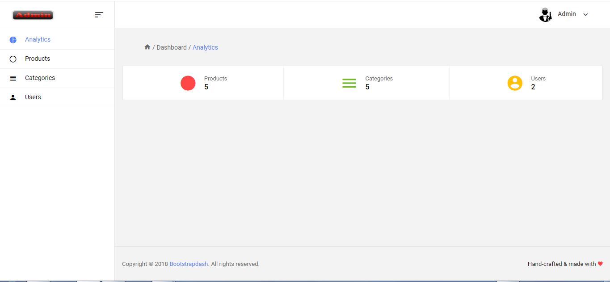

## Description

  
The objective of this project is to develop an e-commerce site for the sale of products online. It provides the user with a catalog of different products available for purchase in the store. In order to facilitate online shopping, the user is provided with a shopping cart, while the administrator can monitor user and product management via the administration panel.
 

## Screenshots

  
  
  

## Demo

https://ecommerce-hibernate-j2ee.herokuapp.com/index.jsp  
  

## Souce code

https://github.com/aniskchaou/ECOMMERCE-J2EE  
  

## Technologies

Java, J2EE, Hibernate, Bootstrap